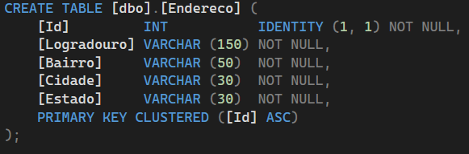

# APIEndereco

Aprendizado de uma API para cadastro e consulta de Endereços em um banco de dados.

### 🛠️ **O que foi utilizado:**
- **Linguagens:** C#
- **Banco de Dados:** SQL Server
- **Framework:** .NET

### Estrutura da tabela Endereços no banco de dados:

